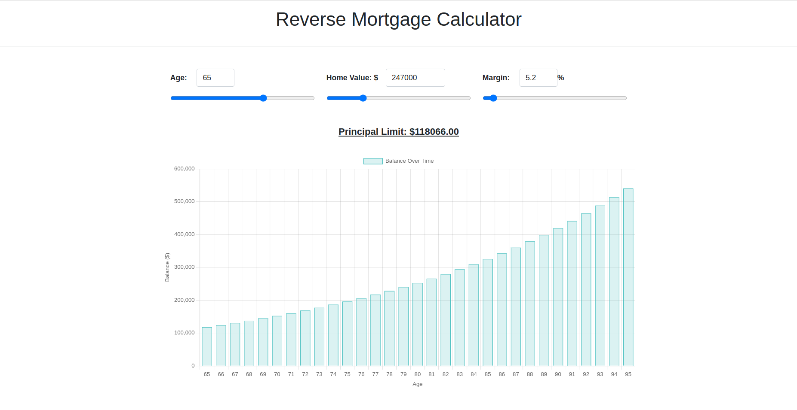

# Reverse Mortgage Calculator

This project implements a Reverse Mortgage Calculator using Python, Django, HTML, JavaScript (with Chart.js), and Bootstrap for styling.

## Features

- Calculate Principal Limit based on age, home value, and margin.
- Display balance over time using a dynamic chart.
- Interactive sliders and inputs for age, home value, and margin.

## UI

## Setup and Usage

1. Clone the repository.
2. Install django with (`pip install django`) 
3. Run server with (`python manage.py runserver`) 

## Technologies Used

- Python
- Django
- HTML
- JavaScript (Chart.js)
- Bootstrap

## Credits

- Developed by Vahta Chaudhary

## License

This project is licensed under the [MIT License](LICENSE).
